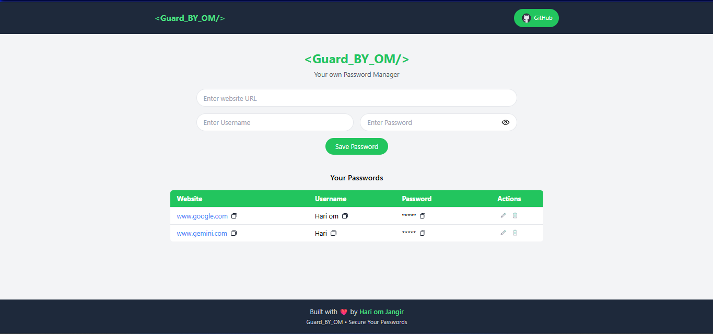

# 🔐 Guard_BY_OM – Password Manager

A simple and secure **Password Manager Web App** built using **React, Express, and MongoDB**.
It allows users to store, edit, copy, and delete passwords for different websites.

This project demonstrates **full-stack development with the MERN stack**, API integration, and CRUD operations.

---

## 🚀 Features

* Save website credentials (Site, Username, Password)
* Edit existing passwords
* Delete saved passwords
* Copy site, username, or password to clipboard
* Show / hide password visibility
* Data stored in **MongoDB database**
* Responsive UI built with **React + TailwindCSS**

---

## 🛠 Tech Stack

### Frontend

* React (Vite)
* Tailwind CSS
* JavaScript
* Fetch API

### Backend

* Node.js
* Express.js
* MongoDB
* Mongoose
* CORS

### Tools

* MongoDB Compass
* Git & GitHub
* VS Code

---

## 📂 Project Structure

```
password-manager
│
├── backend
│   ├── node_modules
│   ├── .env
│   ├── package.json
│   └── server.js
│
├── public
│   ├── copy.svg
│   ├── delete.svg
│   ├── edit.svg
│   ├── eyeopen.svg
│   └── eyeclose.svg
│
├── src
│   ├── components
│   │   ├── Manager.jsx
│   │   ├── Navbar.jsx
│   │   └── footer.jsx
│   │
│   ├── App.jsx
│   ├── main.jsx
│   └── index.css
│
└── README.md
```

---

## ⚙️ Installation

Clone the repository

```
git clone https://github.com/Hariom-Jangir/password-manager.git
cd password-manager
```

---

## 📦 Backend Setup

Go to backend folder

```
cd backend
npm install
```

Create a **.env** file

```
MONGO_URI=mongodb://127.0.0.1:27017/passwordManager
PORT=3000
```

Start backend server

```
node server.js
```

Server will run on

```
http://localhost:3000
```

---

## 💻 Frontend Setup

From root folder run

```
npm install
npm run dev
```

App will start on

```
http://localhost:5173
```

---

## 🔗 API Endpoints

| Method | Endpoint         | Description       |
| ------ | ---------------- | ----------------- |
| GET    | `/passwords`     | Get all passwords |
| POST   | `/passwords`     | Add new password  |
| PUT    | `/passwords/:id` | Update password   |
| DELETE | `/passwords/:id` | Delete password   |

---

## 🧠 How It Works

1. User enters credentials in the React UI
2. React sends request using **Fetch API**
3. Express backend receives request
4. MongoDB stores data
5. API sends response back to React
6. UI updates automatically

---

## 📸 Preview



---

## 🌍 Future Improvements

* User authentication
* Password encryption
* Search and filter passwords
* Deploy full MERN stack

---

## 👨‍💻 Author

**Hariom Jangir**


GitHub: https://github.com/Hariom-Jangir

---

⭐ If you like this project, consider giving it a **star**!
